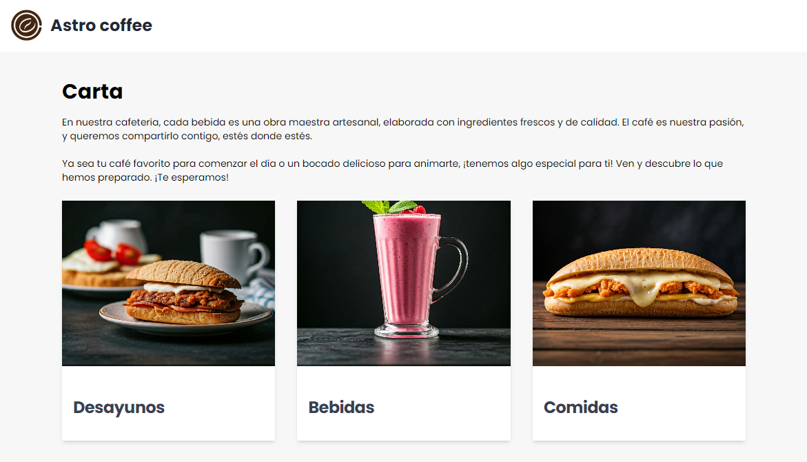

<!-- PROJECT LOGO -->

<a href="">
  
</a>

<!-- ABOUT THE PROJECT -->

# Astro coffee

Astro coffee is a website project built with Astro, designed to simulate a browsing experience for a coffee shop and bar. This project serves as an example of a modern, optimized static web application with an attractive and functional design.

<!-- TABLE OF CONTENTS -->

## 🚩 Table of Contents

- [Built With](#built-with)
- [Getting Started](#getting-started)
- [Contributing](#contributing)
- [License](#license)

### 🛠️ Built With <a id='built-with'></a>

- [![Astro][Astro]][Astro-url]
- [![Tailwind CSS][Tailwind]][Tailwind-url]

[Astro]: https://img.shields.io/badge/astro-%232C2052.svg?style=for-the-badge&logo=astro&logoColor=white
[Astro-url]: https://astro.build/
[Tailwind]: https://img.shields.io/badge/Tailwind_CSS-38B2AC?style=for-the-badge&logo=tailwind-css&logoColor=white
[Tailwind-url]: https://tailwindcss.com/

<!-- GETTING STARTED -->

## ⭐ Getting Started <a id='getting-started'></a>

1. Clone the repository:

```bash
https://github.com/javiermartins/astro-coffee.git
```

2. Install dependencies:

```bash
npm install
```

3. Run the development server:

```bash
npm run dev
```

You can access the website by visiting http://localhost:4321 in your browser.

<!-- CONTRIBUTING -->

## 💬 Contributing <a id='contributing'></a>

Contributions make the open-source community great. Any help is **appreciated**!

To suggest improvements, fork the repo and create a pull request or open an "enhancement" issue. Don’t forget to star the project!

### How to Contribute

1. Fork the Project
2. Create a Feature Branch (`git checkout -b feature/changes`)
3. Commit Changes (`git commit -m 'Some changes'`)
4. Push the Branch (`git push origin feature/changes`)
5. Open a Pull Request

Thanks for contributing!

<!-- LICENSE -->

## 📜 License <a id='license'></a>

This software distributed under the [MIT License](https://github.com/javiermartins/astro-coffee/blob/master/LICENSE)
